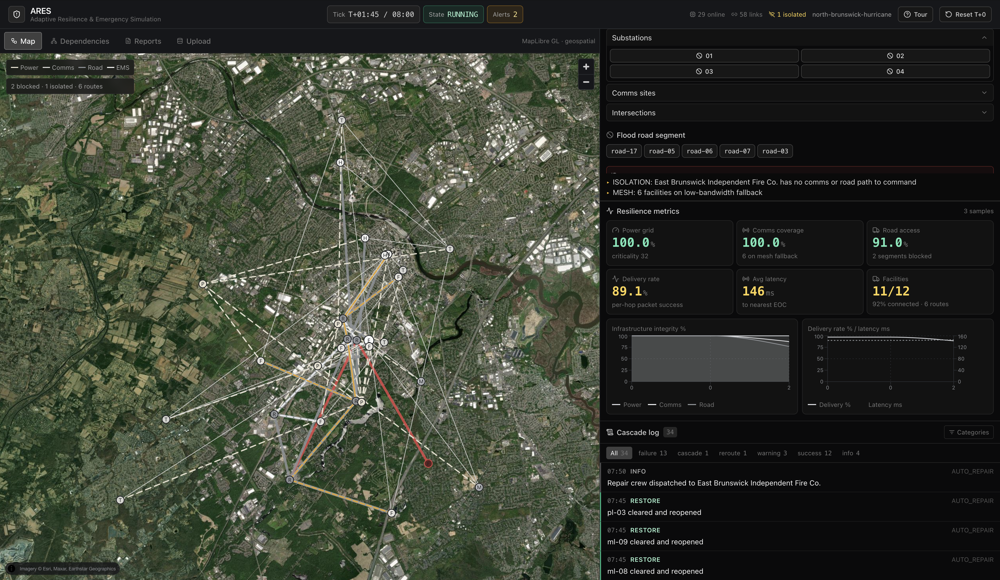

# ARES



## What it is

ARES is a training console for emergency response planning. It models the power, communications, road and hospital network of a town, then lets you break it on purpose.

You knock out a substation, flood a road or destroy a cell tower, and ARES works out what that breaks. Because every asset depends on others, one failure usually causes more: a dead substation takes out cell towers, which drops hospital communications, which forces ambulances to reroute. ARES shows that chain as it happens, records it, and writes up the result.

It is a simulator built for practice and discussion, not a live emergency system.

## How it works

1. **Pick a place.** ARES ships with a scenario for North Brunswick, New Jersey. You can also upload your own town as a simple JSON file.
2. **Look around.** The same network appears in three ways: a map for geography, a dependency graph for logic, and a set of live figures for health.
3. **Start the clock.** Time moves forward five minutes at a time. On its own, nothing breaks.
4. **Break something.** Choose an event from the console: a blackout, a flood, a damaged tower. You can pick several at once and ARES applies them in order.
5. **Watch it spread.** After every change ARES re-checks the whole network and marks whatever lost service as a direct or knock-on failure. Anything cut off from the rest is flagged as isolated.
6. **Read the result.** A running log records what happened and why. The report tab pulls it together, and you can export it as text or JSON.

Because the effects are re-calculated from scratch each time, you can pause, change your mind, restore a facility and see the numbers move back.

## What you need

- **Go** and **Node.js** (with npm)
- A web browser
- Nothing else. No database, no API keys, no account.

The map uses a satellite tile service. If its key is missing or rejected, ARES automatically falls back to free imagery so the rest of the console keeps working.

To start it:

```bash
./run.sh
```

Then open <http://localhost:8080>.

## Tech stack

**Backend** — Go, with SQLite for optional storage

**Frontend** — React and TypeScript, built with Vite

**Libraries** — Tailwind CSS for styling, Zustand for state, MapLibre GL for the map, React Flow for the dependency graph, Recharts for the charts, lucide-react for icons

**Communication** — REST for one-off requests, WebSocket for live updates
